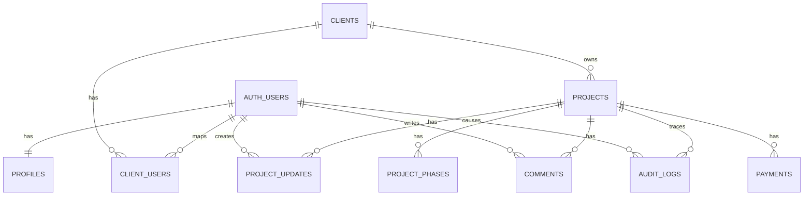

# Client Project Portal - Backend MVP

Primera etapa del portal privado de clientes usando Supabase como backend. No incluye frontend visual; deja preparada la base segura para un futuro React + Vite en Netlify usando Supabase Auth, SDK JS, PostgreSQL y RLS.

## Entregables

- Migración principal: `supabase/migrations/20260918000100_client_project_portal.sql`
- Endurecimiento de funciones: `supabase/migrations/20260918000200_harden_trigger_search_paths.sql`
- Seed demo editable: `supabase/seed.sql`
- Pruebas manuales RLS: `docs/rls-test-queries.sql`
- Resultados de verificación local y remota: `docs/backend-test-report.md`
- Plan de la siguiente etapa: `docs/frontend-implementation-plan.md`
- Planes originales: `implementation_plan.md` y `implementation_plan_front.md`

Cada migración es una transacción con nombre compatible con Supabase CLI. El seed y las pruebas se ejecutan por separado para que un despliegue no inserte datos demo ni ejecute consultas de prueba.

Los SQL iniciales del primer plan están conservados en `docs/reference/stage1-sql/`. Son material histórico, no migraciones activas; ejecuta únicamente las dos migraciones con timestamp indicadas arriba y en ese orden. Las rutas absolutas de archivos dentro de `implementation_plan.md` pertenecen a su ubicación original.

## Arquitectura

Supabase Auth gestiona email/password. PostgreSQL guarda perfiles, clientes, proyectos, fases, actualizaciones, pagos informativos, comentarios y auditoría. El futuro frontend debe usar solo la publishable/anon key con sesión de usuario; la autorización real vive en RLS.



## Decisiones

- Roles: `profiles.role` es la fuente confiable. No se usa `user_metadata` para autorización porque puede venir de datos modificables por el usuario. Para escalar, se puede migrar a `app_metadata` o custom claims, pero para este MVP `profiles` es más simple y auditable.
- Perfiles: un trigger sobre `auth.users` crea cada perfil con rol `client` por defecto. El primer admin se promueve manualmente desde SQL Editor después de crear su cuenta. Las sesiones autenticadas solo tienen permiso de actualización sobre `profiles.full_name`, no sobre `role`.
- Multi-cliente futuro: `clients` y `client_users` existen desde el inicio aunque hoy haya un cliente y una cuenta compartida.
- RLS: todas las tablas privadas tienen RLS. Las policies son explícitas por tabla y rol; no hay `USING (true)`.
- Helpers RLS: `app.is_admin()`, `app.can_access_client()` y `app.can_access_project()` viven fuera del esquema público expuesto por la API. Son `SECURITY DEFINER`, usan `search_path = ''` y consultan el rol y la pertenencia del usuario autenticado.
- Seguridad anti-DevTools: aunque el cliente modifique IDs o llamadas al SDK, `app.can_access_project()` y `app.can_access_client()` verifican pertenencia real en PostgreSQL.
- Auditoría: triggers generan logs para creación, actualización y borrado de proyectos, fases y pagos, incluidos cambios de estado/progreso y cierre. `audit_logs.project_id` conserva el UUID incluso si se borra el proyecto. Los clientes no pueden leer los logs.
- Comentarios: clientes y admin pueden crear comentarios. Cada autor puede editar o hacer soft-delete de un comentario propio durante 15 minutos; el admin puede moderar comentarios en cualquier momento. El autor conserva lectura de su comentario eliminado para que RLS permita el soft-delete; la UI filtra `deleted_at is null`. Nadie tiene permiso de borrado físico por SDK.
- Cierre de proyecto: al poner `status = completed`, el trigger fija `completed_at` y fuerza `progress_percentage = 100`. El historial permanece.
- Service role/secret key: nunca va en React, Vite, Netlify público ni navegador. Si en el futuro hace falta una acción privilegiada, debe ejecutarse en Supabase Edge Functions, Netlify Functions o un backend controlado.

## Modelo de Datos

Tablas:

- `profiles`: perfil y rol confiable del usuario autenticado.
- `clients`: organización cliente.
- `client_users`: relación N:N para soportar múltiples usuarios por cliente.
- `projects`: proyecto, estado, progreso, fechas y fase actual.
- `project_phases`: roadmap ordenado; índice parcial garantiza máximo una fase activa por proyecto.
- `project_updates`: timeline creado solo por admin.
- `payments`: estado financiero informativo, sin tarjetas ni datos sensibles.
- `comments`: conversación simple por proyecto.
- `audit_logs`: trazabilidad administrativa.

Enums:

- `app_role`: `admin`, `client`
- `project_status`: `planned`, `active`, `paused`, `completed`, `cancelled`
- `phase_status`: `pending`, `active`, `completed`
- `payment_status`: `pending`, `paid`, `overdue`, `cancelled`

Constraints importantes:

- `projects.progress_percentage between 0 and 100`
- `projects.slug` en formato URL-safe
- `projects.slug` es único dentro de cada cliente; clientes distintos pueden reutilizarlo
- `clients.accent_color` tipo `#RRGGBB`
- `project_phases.position > 0`
- `unique (project_id, position)`
- `unique active phase per project`
- `current_phase_id` debe apuntar a una fase activa del mismo proyecto
- una fase no puede trasladarse a otro proyecto después de creada
- un cliente con proyectos no puede borrarse por la FK de `projects.client_id`

## RLS Resumen

ADMIN:

- CRUD en `clients`, `client_users`, `projects`, `project_phases`, `project_updates`, `payments`.
- Lee `comments` y `audit_logs`.
- Crea comentarios usando su propio `auth.uid()`.
- Puede actualizar nombres en `profiles`; la asignación inicial de `admin` se hace en SQL Editor.

CLIENT:

- Lee solo su `client`, sus `projects`, fases, updates, payments y comentarios no eliminados; también puede leer sus propios comentarios eliminados.
- Inserta comentarios solo en proyectos accesibles y solo con `user_id = auth.uid()`.
- Puede editar o hacer soft-delete de comentarios propios durante 15 minutos.
- Puede actualizar su `profiles.full_name`, pero no su rol.
- No modifica clientes, proyectos, progreso, fases, pagos, updates ni audit logs.

## Configuración Supabase

1. Crea un proyecto Supabase y desactiva el registro público en Authentication > General configuration: apaga `Allow new users to sign up`. Conserva habilitado el acceso por email y contraseña.
2. Ejecuta las dos migraciones de `supabase/migrations/` en orden desde SQL Editor, o usa `supabase db push` con el proyecto vinculado.
3. En Authentication > Users crea manualmente y confirma estos usuarios:
   - `admin@example.com`
   - `client@example.com`
4. Verifica que el trigger haya creado ambos perfiles con `role = client`. Copia los UUID reales desde Authentication > Users.
5. Desde SQL Editor, asigna el rol de administrador a tu cuenta:

   ```sql
   update public.profiles
   set role = 'admin', full_name = 'Portal Administrator'
   where id = '<ADMIN_USER_UUID>';
   ```

6. Edita `supabase/seed.sql` y reemplaza:
   - `00000000-0000-0000-0000-000000000001` por el UUID del admin.
   - `00000000-0000-0000-0000-000000000002` por el UUID del cliente.
7. Ejecuta `supabase/seed.sql` desde SQL Editor. El script valida que los perfiles y roles ya existan.
8. Reemplaza los mismos UUIDs en `docs/rls-test-queries.sql` y ejecuta sus pruebas desde SQL Editor.

Si los usuarios ya existían antes de aplicar la migración, el trigger no crea perfiles retroactivamente: crea sus filas manualmente desde SQL Editor antes del paso 5.

El seed es solo para una instancia de demostración. Ejecutarlo de nuevo puede sobrescribir los datos demo con sus valores iniciales.

## Flujo Futuro del Frontend

Después de login con Supabase JS:

1. `supabase.auth.getUser()`
2. leer `profiles` para mostrar nombre/rol
3. leer `client_users` para obtener `client_id`
4. leer `clients`
5. leer `projects`
6. para el proyecto: `project_phases`, `project_updates`, `payments`, `comments`

No hace falta confiar en filtros de React para seguridad. El frontend puede filtrar para UX, pero RLS decide qué filas existen para ese usuario.

## Queries de Uso

Cliente leyendo su dashboard:

```sql
select * from public.projects order by created_at desc;
select * from public.project_phases where project_id = '<project_id>' order by position;
select * from public.project_updates where project_id = '<project_id>' order by created_at desc;
select * from public.payments where project_id = '<project_id>' order by due_date nulls last;
select * from public.comments where project_id = '<project_id>' and deleted_at is null order by created_at;
```

Cliente creando comentario:

```sql
insert into public.comments (project_id, user_id, message)
values ('<project_id>', auth.uid(), 'Mensaje del cliente');
```

Edición de un comentario propio durante los primeros 15 minutos:

```sql
update public.comments
set message = 'Mensaje corregido'
where id = '<comment_id>';
```

Admin actualizando progreso:

```sql
update public.projects
set progress_percentage = 70
where id = '<project_id>';
```

Admin cerrando proyecto:

```sql
update public.projects
set status = 'completed'
where id = '<project_id>';
```

## Pruebas de Autorización

Usa `docs/rls-test-queries.sql` después de reemplazar los UUIDs. Valida:

Para comprobar el login real, usa una sesión de prueba del SDK con la publishable key y las credenciales del cliente:

```js
import { createClient } from '@supabase/supabase-js';

const supabase = createClient('<SUPABASE_URL>', '<PUBLISHABLE_KEY>');
const { data, error } = await supabase.auth.signInWithPassword({
  email: 'client@example.com',
  password: '<password-created-in-auth>'
});
if (error) throw error;
const { data: projects, error: projectsError } = await supabase
  .from('projects')
  .select('id, name, status');
if (projectsError) throw projectsError;
// data.user debe existir y projects solo debe contener proyectos de ABC Construction.
```

- CLIENT puede leer su proyecto, fases, updates, payments y comments.
- CLIENT puede insertar un comment propio.
- CLIENT puede editar o hacer soft-delete de un comentario propio reciente, pero no cambiar su identidad, proyecto o fecha de creación.
- CLIENT no puede cambiar progreso.
- CLIENT no puede cerrar proyectos, crearlos ni eliminarlos.
- CLIENT no puede completar fases.
- CLIENT no puede modificar ni eliminar payments ni publicar updates.
- CLIENT no puede ver audit logs.
- CLIENT no puede modificar clients.
- CLIENT original no puede ver el segundo cliente ni su proyecto, fases, updates o payments, ni comentarlo.
- ADMIN sí puede leer todo, crear clientes, publicar updates y respuestas, actualizar progreso, completar fases, cambiar payments y leer audit logs.

## Checklist Manual Antes de React

- RLS aparece habilitado para todas las tablas públicas del portal.
- No existen grants a `anon` sobre tablas privadas.
- Signup público está desactivado.
- `admin@example.com` y `client@example.com` existen y pueden iniciar sesión.
- `profiles.role` del admin es `admin`; el cliente es `client`.
- Los perfiles se crearon automáticamente al crear usuarios en Auth.
- `client_users` relaciona el usuario cliente con `ABC Construction`.
- La cuenta cliente ve solo `Local File Server Implementation`.
- El segundo cliente/proyecto de prueba no aparece para la cuenta cliente original.
- Las pruebas negativas no actualizan filas.
- `audit_logs` registra cambios admin relevantes.
- Los borrados de proyectos, fases y pagos dejan entradas en `audit_logs` con `old_values`.
- No hay secret/service role key en variables `VITE_*`, Netlify frontend env pública o código del navegador.

## Referencias Supabase

- RLS, grants, `auth.uid()` y service role: https://supabase.com/docs/guides/database/postgres/row-level-security
- Configuración general de Auth y signup: https://supabase.com/docs/guides/auth/general-configuration
- Publishable vs secret keys: https://supabase.com/docs/guides/getting-started/api-keys
