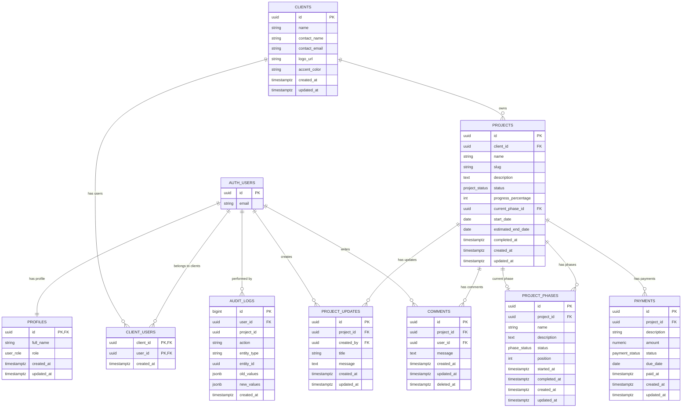

# Client Project Portal — Stage 1: Supabase Backend

## Objective

Design and implement the complete backend infrastructure for a private client project portal using Supabase (PostgreSQL + Auth + RLS). This stage produces all database objects, security policies, seed data, and verification tests — ready for a future React + Vite frontend.

---

## Architectural Decisions

### 1. Role Strategy: `profiles` table (not `app_metadata`, not `user_metadata`)

| Option | Verdict | Reason |
|---|---|---|
| `user_metadata` | ❌ Rejected | Users can modify their own `user_metadata` via the SDK — a client could set `role: 'admin'` |
| `app_metadata` / custom JWT claims | ⚠️ Considered | Secure (only writable via service_role), fast in RLS (no join). But harder to manage relationally, harder to query from the dashboard, and overkill for an MVP with 2 users |
| **`profiles` table** | ✅ **Chosen** | Role lives in PostgreSQL, protected by RLS. Easy to query, audit, and extend. The `profiles.role` column is the single source of truth. Performance is excellent with an index on `id` (PK) |

The `profiles` row is created automatically via a trigger on `auth.users` insert, with `role = 'client'` by default. The admin role is set manually via a single `UPDATE` after account creation.

> [!IMPORTANT]
> No RLS policy ever reads `raw_user_meta_data` or trusts anything sent from the browser for authorization decisions. Every policy resolves the role by querying `profiles` via `auth.uid()`.

### 2. Helper Functions for RLS

Two `SECURITY DEFINER` helper functions keep policies readable and centralize tenant resolution:

| Function | Returns | Used in |
|---|---|---|
| `public.is_admin()` | `BOOLEAN` | Every admin-only policy |
| `public.get_client_ids()` | `SETOF UUID` | Every client-scoped read policy |

`SECURITY DEFINER` ensures these functions execute with the permissions of the function owner (typically the `postgres` role), which can read the `profiles` and `client_users` tables even when RLS is active on those tables. Without this, RLS on `profiles` would block `is_admin()` from reading the role — creating a circular dependency.

### 3. Single Active Phase Enforcement

A **partial unique index** on `project_phases` guarantees at most one `active` phase per project at the database level:

```sql
CREATE UNIQUE INDEX idx_one_active_phase_per_project
ON project_phases (project_id) WHERE status = 'active';
```

This is the idiomatic PostgreSQL approach — lightweight, concurrent-safe, and requires zero trigger logic.

### 4. Audit Strategy

A combination approach:

- **Triggers** on critical tables (`projects`, `project_phases`, `payments`) automatically log `INSERT`/`UPDATE`/`DELETE` operations with old/new JSONB values. This guarantees audit coverage regardless of whether changes come from the frontend SDK, the dashboard, or a future Edge Function.
- The audit trigger function captures `auth.uid()` so we know *who* made the change.
- `audit_logs` has RLS enabled: only admin can read, nobody writes directly (triggers use `SECURITY DEFINER`).

### 5. Supabase Auth Configuration

- **Disable public signup** in Dashboard → Authentication → Providers → Email → toggle off "Enable email signup"
- Both accounts (admin + client) are created **manually** via the Supabase Dashboard
- The client receives credentials directly (no invite email needed for MVP)
- Frontend will only expose a login form — no `signUp()` call ever exists in the codebase

### 6. Service Role Key

The `service_role` key **never** appears in:
- React source code
- Vite environment variables (`VITE_*`)
- Any file deployed to Netlify

If a future operation requires `service_role` (e.g., creating users programmatically, bulk admin operations), it must run in:
- A Supabase Edge Function
- Or a lightweight server-side endpoint

For this MVP, all admin operations go through the SDK with the anon key + authenticated session + RLS.

---

## Entity Relationship Diagram



---

## Proposed Changes

### Enum Types

Three custom PostgreSQL enums avoid magic strings and provide type safety with CHECK constraints at the DB level:

| Enum | Values |
|---|---|
| `user_role` | `admin`, `client` |
| `project_status` | `planned`, `active`, `paused`, `completed`, `cancelled` |
| `phase_status` | `pending`, `active`, `completed` |
| `payment_status` | `pending`, `paid`, `overdue`, `cancelled` |

---

### SQL Migration Files

All SQL will be organized into numbered migration files for clarity and execution order:

#### [NEW] [00_enums.sql](file:///c:/Users/artej/Documents/MrRobot/client_portal/supabase/migrations/00_enums.sql)

Creates the four enum types: `user_role`, `project_status`, `phase_status`, `payment_status`.

#### [NEW] [01_tables.sql](file:///c:/Users/artej/Documents/MrRobot/client_portal/supabase/migrations/01_tables.sql)

Creates all 9 tables with:
- UUID primary keys (generated by `gen_random_uuid()`)
- Foreign keys with appropriate `ON DELETE` behavior:
  - `profiles.id` → `auth.users.id` `ON DELETE CASCADE`
  - `client_users` → composite PK, cascades on both sides
  - `projects.client_id` → `clients.id` `ON DELETE RESTRICT` (don't delete a client with active projects)
  - `projects.current_phase_id` → `project_phases.id` `ON DELETE SET NULL`
  - All other FK references use `ON DELETE CASCADE` (delete project → cascades phases, updates, payments, comments)
- CHECK constraints:
  - `projects.progress_percentage BETWEEN 0 AND 100`
  - `payments.amount >= 0`
- Default values for timestamps (`now()`)
- Nullable fields as specified

#### [NEW] [02_indexes.sql](file:///c:/Users/artej/Documents/MrRobot/client_portal/supabase/migrations/02_indexes.sql)

Key indexes:

| Index | Purpose |
|---|---|
| `idx_profiles_role` on `profiles(role)` | Fast admin lookup in RLS |
| `idx_client_users_user_id` on `client_users(user_id)` | Fast tenant resolution |
| `idx_client_users_client_id` on `client_users(client_id)` | Lookup users by client |
| `idx_projects_client_id` on `projects(client_id)` | Projects per client |
| `idx_projects_slug` UNIQUE on `projects(slug)` | URL-friendly project lookup |
| `idx_project_phases_project_id` on `project_phases(project_id)` | Phases per project |
| `idx_project_phases_position` on `project_phases(project_id, position)` | Ordered phase list |
| `idx_one_active_phase_per_project` UNIQUE on `project_phases(project_id) WHERE status = 'active'` | Enforce single active phase |
| `idx_project_updates_project_id` on `project_updates(project_id)` | Updates per project |
| `idx_payments_project_id` on `payments(project_id)` | Payments per project |
| `idx_comments_project_id` on `comments(project_id)` | Comments per project |
| `idx_audit_logs_entity` on `audit_logs(entity_type, entity_id)` | Audit lookup by entity |
| `idx_audit_logs_project_id` on `audit_logs(project_id)` | Audit lookup by project |

#### [NEW] [03_helper_functions.sql](file:///c:/Users/artej/Documents/MrRobot/client_portal/supabase/migrations/03_helper_functions.sql)

```sql
-- Returns TRUE if the current authenticated user has role = 'admin'
CREATE OR REPLACE FUNCTION public.is_admin()
RETURNS BOOLEAN
LANGUAGE sql STABLE
SECURITY DEFINER
SET search_path = ''
AS $$
  SELECT EXISTS (
    SELECT 1 FROM public.profiles
    WHERE id = auth.uid()
    AND role = 'admin'
  );
$$;

-- Returns all client_ids the current user belongs to
CREATE OR REPLACE FUNCTION public.get_client_ids()
RETURNS SETOF UUID
LANGUAGE sql STABLE
SECURITY DEFINER
SET search_path = ''
AS $$
  SELECT client_id FROM public.client_users
  WHERE user_id = auth.uid();
$$;
```

> [!NOTE]
> These functions live in `public` schema intentionally — they are called by RLS policies which expect `public.is_admin()`. The functions are safe to expose since they only return data about the calling user. `SET search_path = ''` forces fully-qualified table names inside the function body, preventing schema hijacking.

Both use `SECURITY DEFINER` to bypass RLS when checking roles (avoids circular dependency). Both are `STABLE` (same result within a transaction) for query planner optimization. Both use `SET search_path = ''` to prevent search-path hijacking attacks.

> [!TIP]
> **RLS Performance**: All RLS policies will wrap `auth.uid()` as `(SELECT auth.uid())` — this tells PostgreSQL to evaluate it once as a subplan and cache the result, instead of re-evaluating per row. Same pattern applies to helper function calls: `(SELECT public.is_admin())`.

#### [NEW] [04_rls_policies.sql](file:///c:/Users/artej/Documents/MrRobot/client_portal/supabase/migrations/04_rls_policies.sql)

Full RLS policy map:

##### `profiles`

| Policy | Operation | Who | Rule |
|---|---|---|---|
| `profiles_select_own` | SELECT | authenticated | `id = auth.uid()` |
| `profiles_select_admin` | SELECT | authenticated | `is_admin()` |
| `profiles_update_own` | UPDATE | authenticated | `id = auth.uid()` — can update `full_name` only, NOT `role` |

> [!WARNING]
> The `profiles_update_own` policy restricts column updates. The `role` column must NOT be updatable by any user through the SDK. A separate trigger will reject any attempt to modify `role` unless the current user is admin.

##### `clients`

| Policy | Operation | Who | Rule |
|---|---|---|---|
| `clients_admin_all` | ALL | authenticated | `is_admin()` |
| `clients_select_own` | SELECT | authenticated | `id IN (SELECT get_client_ids())` |

##### `client_users`

| Policy | Operation | Who | Rule |
|---|---|---|---|
| `client_users_admin_all` | ALL | authenticated | `is_admin()` |
| `client_users_select_own` | SELECT | authenticated | `user_id = auth.uid()` |

##### `projects`

| Policy | Operation | Who | Rule |
|---|---|---|---|
| `projects_admin_all` | ALL | authenticated | `is_admin()` |
| `projects_select_client` | SELECT | authenticated | `client_id IN (SELECT get_client_ids())` |

##### `project_phases`

| Policy | Operation | Who | Rule |
|---|---|---|---|
| `phases_admin_all` | ALL | authenticated | `is_admin()` |
| `phases_select_client` | SELECT | authenticated | `project_id IN (SELECT id FROM projects WHERE client_id IN (SELECT get_client_ids()))` |

##### `project_updates`

| Policy | Operation | Who | Rule |
|---|---|---|---|
| `updates_admin_all` | ALL | authenticated | `is_admin()` |
| `updates_select_client` | SELECT | authenticated | `project_id IN (SELECT id FROM projects WHERE client_id IN (SELECT get_client_ids()))` |

##### `payments`

| Policy | Operation | Who | Rule |
|---|---|---|---|
| `payments_admin_all` | ALL | authenticated | `is_admin()` |
| `payments_select_client` | SELECT | authenticated | `project_id IN (SELECT id FROM projects WHERE client_id IN (SELECT get_client_ids()))` |

##### `comments`

| Policy | Operation | Who | Rule |
|---|---|---|---|
| `comments_admin_select` | SELECT | authenticated | `is_admin()` |
| `comments_admin_insert` | INSERT | authenticated | `is_admin()` — WITH CHECK: `user_id = auth.uid()` |
| `comments_select_client` | SELECT | authenticated | `project_id IN (SELECT id FROM projects WHERE client_id IN (SELECT get_client_ids()))` |
| `comments_insert_client` | INSERT | authenticated | NOT `is_admin()` — WITH CHECK: `user_id = auth.uid() AND project_id IN (SELECT id FROM projects WHERE client_id IN (SELECT get_client_ids()))` |
| `comments_update_own` | UPDATE | authenticated | `user_id = auth.uid() AND deleted_at IS NULL AND created_at > now() - interval '15 minutes'` |

> [!NOTE]
> Comments can only be edited within 15 minutes of creation and cannot be edited once soft-deleted. This prevents retroactive tampering while allowing quick typo fixes. Neither admin nor client can hard-delete comments — only soft-delete via `deleted_at` timestamp.

##### `audit_logs`

| Policy | Operation | Who | Rule |
|---|---|---|---|
| `audit_logs_admin_select` | SELECT | authenticated | `is_admin()` |

No INSERT/UPDATE/DELETE policies — audit_logs are written exclusively by `SECURITY DEFINER` trigger functions.

#### [NEW] [05_triggers.sql](file:///c:/Users/artej/Documents/MrRobot/client_portal/supabase/migrations/05_triggers.sql)

##### Auto-create profile on user signup

```sql
CREATE OR REPLACE FUNCTION public.handle_new_user()
RETURNS TRIGGER AS $$
BEGIN
  INSERT INTO public.profiles (id, full_name, role)
  VALUES (
    NEW.id,
    COALESCE(NEW.raw_user_meta_data ->> 'full_name', ''),
    'client'  -- Default role is always 'client'
  );
  RETURN NEW;
END;
$$ LANGUAGE plpgsql SECURITY DEFINER;

CREATE TRIGGER on_auth_user_created
  AFTER INSERT ON auth.users
  FOR EACH ROW EXECUTE FUNCTION public.handle_new_user();
```

##### Prevent role modification by non-admins

```sql
CREATE OR REPLACE FUNCTION public.protect_role_update()
RETURNS TRIGGER AS $$
BEGIN
  IF OLD.role IS DISTINCT FROM NEW.role THEN
    IF NOT public.is_admin() THEN
      RAISE EXCEPTION 'Only administrators can modify user roles';
    END IF;
  END IF;
  NEW.updated_at = now();
  RETURN NEW;
END;
$$ LANGUAGE plpgsql SECURITY DEFINER;

CREATE TRIGGER on_profile_update
  BEFORE UPDATE ON public.profiles
  FOR EACH ROW EXECUTE FUNCTION public.protect_role_update();
```

##### Auto-update `updated_at` timestamps

A generic trigger function applied to all tables with `updated_at`:

```sql
CREATE OR REPLACE FUNCTION public.set_updated_at()
RETURNS TRIGGER AS $$
BEGIN
  NEW.updated_at = now();
  RETURN NEW;
END;
$$ LANGUAGE plpgsql;
```

Applied to: `clients`, `projects`, `project_phases`, `project_updates`, `payments`, `comments`.

##### Audit log trigger

```sql
CREATE OR REPLACE FUNCTION public.audit_log_trigger()
RETURNS TRIGGER AS $$
DECLARE
  _project_id UUID;
  _old JSONB;
  _new JSONB;
BEGIN
  -- Determine project_id based on table
  IF TG_TABLE_NAME = 'projects' THEN
    _project_id := COALESCE(NEW.id, OLD.id);
  ELSIF TG_TABLE_NAME IN ('project_phases', 'project_updates', 'payments', 'comments') THEN
    _project_id := COALESCE(NEW.project_id, OLD.project_id);
  END IF;

  _old := CASE WHEN TG_OP IN ('UPDATE', 'DELETE') THEN to_jsonb(OLD) ELSE NULL END;
  _new := CASE WHEN TG_OP IN ('INSERT', 'UPDATE') THEN to_jsonb(NEW) ELSE NULL END;

  INSERT INTO public.audit_logs (user_id, project_id, action, entity_type, entity_id, old_values, new_values)
  VALUES (
    auth.uid(),
    _project_id,
    TG_OP,
    TG_TABLE_NAME,
    COALESCE(NEW.id, OLD.id),
    _old,
    _new
  );

  RETURN NULL; -- AFTER trigger, return value is ignored
END;
$$ LANGUAGE plpgsql SECURITY DEFINER;
```

Applied as `AFTER INSERT OR UPDATE OR DELETE` triggers on:
- `projects`
- `project_phases`
- `payments`

> [!NOTE]
> `project_updates` and `comments` are deliberately excluded from the heavy audit trigger to avoid noise. They are already timestamped and attributable via `created_by`/`user_id`. If audit coverage is needed later, the trigger can be extended.

#### [NEW] [06_seed_data.sql](file:///c:/Users/artej/Documents/MrRobot/client_portal/supabase/migrations/06_seed_data.sql)

Seed data that must be run **after** the admin and client users are created manually in the Dashboard. The script uses placeholder UUIDs that must be replaced with actual `auth.users.id` values.

**Demo data:**
- **Client**: ABC Construction
- **Project**: Local File Server Implementation (slug: `local-file-server`, status: `active`, progress: 60%)
- **5 Phases**: Requirements ✅ → Solution Design ✅ → Implementation 🔵 → Testing ⏳ → Delivery ⏳
- **2 Payments**: Initial ($600,000 paid), Final ($600,000 pending)
- **2 Updates**: Server config complete, User permissions in progress
- **1 Comment** from admin: "Let me know if you have any questions about the current progress."

#### [NEW] [07_security_tests.sql](file:///c:/Users/artej/Documents/MrRobot/client_portal/supabase/migrations/07_security_tests.sql)

This file contains commented-out test queries organized by scenario, designed to be run from the Supabase SQL Editor while impersonating different users via `SET LOCAL role` and `SET LOCAL request.jwt.claims`.

---

## Supabase Auth Configuration

### Step-by-step instructions

#### 1. Disable public signup
1. Go to **Supabase Dashboard** → **Authentication** → **Providers** → **Email**
2. Toggle **"Enable email signup"** → **OFF**
3. Keep **"Enable email login"** → **ON**
4. Save

#### 2. Create admin account
1. Go to **Authentication** → **Users** → **Add user** → **Create new user**
2. Email: `admin@yourdomain.com` (use your real email)
3. Password: a strong password
4. Check **"Auto Confirm User"** ✅
5. Click **Create**
6. Copy the user's UUID from the dashboard

#### 3. Create client account
1. Same flow as above
2. Email: `client@abcconstruction.com` (or whatever email you'll give the client)
3. Password: a strong password (you'll share this with the client)
4. Check **"Auto Confirm User"** ✅
5. Click **Create**
6. Copy the user's UUID

#### 4. Set admin role
After both users are created, the `handle_new_user` trigger will have created `profiles` rows with `role = 'client'`. Update the admin:

```sql
UPDATE public.profiles
SET role = 'admin', full_name = 'Your Name'
WHERE id = '<ADMIN_USER_UUID>';
```

Update client name:
```sql
UPDATE public.profiles
SET full_name = 'ABC Construction Contact'
WHERE id = '<CLIENT_USER_UUID>';
```

> [!IMPORTANT]
> This `UPDATE` must be run from the **SQL Editor** in the Dashboard (which uses `service_role` and bypasses RLS). The admin cannot promote themselves from the frontend because the `protect_role_update` trigger checks `is_admin()`, and the user isn't admin yet at that point.

#### 5. Run seed data
Replace the placeholder UUIDs in `06_seed_data.sql` with the actual UUIDs from step 2-3, then run the script from the SQL Editor.

---

## Security Verification Tests

### Tests the CLIENT CAN do

| # | Test | Expected |
|---|---|---|
| 1 | Login with client credentials | ✅ Session obtained |
| 2 | `SELECT * FROM clients` | ✅ Returns only ABC Construction |
| 3 | `SELECT * FROM projects` | ✅ Returns only Local File Server |
| 4 | `SELECT * FROM project_phases WHERE project_id = '<project_id>'` | ✅ Returns 5 phases |
| 5 | `SELECT * FROM project_updates WHERE project_id = '<project_id>'` | ✅ Returns 2 updates |
| 6 | `SELECT * FROM payments WHERE project_id = '<project_id>'` | ✅ Returns 2 payments |
| 7 | `INSERT INTO comments (project_id, user_id, message) VALUES (...)` | ✅ Comment created |

### Tests the CLIENT CANNOT do

| # | Test | Expected |
|---|---|---|
| 8 | `UPDATE projects SET progress_percentage = 100` | ❌ 0 rows affected |
| 9 | `UPDATE projects SET status = 'completed'` | ❌ 0 rows affected |
| 10 | `UPDATE project_phases SET status = 'completed'` | ❌ 0 rows affected |
| 11 | `UPDATE payments SET status = 'paid'` | ❌ 0 rows affected |
| 12 | `INSERT INTO project_updates (...)` | ❌ 0 rows affected |
| 13 | `DELETE FROM payments WHERE id = '...'` | ❌ 0 rows affected |
| 14 | `SELECT * FROM audit_logs` | ❌ 0 rows returned |
| 15 | `UPDATE clients SET name = 'Hacked'` | ❌ 0 rows affected |
| 16 | `INSERT INTO projects (...)` | ❌ Rejected |
| 17 | `DELETE FROM projects WHERE id = '...'` | ❌ 0 rows affected |

### Tests the ADMIN CAN do

| # | Test | Expected |
|---|---|---|
| 18 | `UPDATE projects SET progress_percentage = 75` | ✅ Updated |
| 19 | `UPDATE project_phases SET status = 'completed'` | ✅ Updated |
| 20 | `INSERT INTO project_updates (...)` | ✅ Created |
| 21 | `UPDATE payments SET status = 'paid'` | ✅ Updated |
| 22 | `SELECT * FROM audit_logs` | ✅ Returns audit entries |
| 23 | `INSERT INTO clients (...)` | ✅ New client created |

### Cross-tenant isolation test (CRITICAL)

| # | Test | Expected |
|---|---|---|
| 24 | Create a 2nd client + project via admin | ✅ Created |
| 25 | Login as original client → `SELECT * FROM clients` | ✅ Returns only ABC Construction (not client 2) |
| 26 | Login as original client → `SELECT * FROM projects` | ✅ Returns only their project (not project 2) |
| 27 | Login as original client → attempt to read project 2 phases/updates/payments by ID | ❌ 0 rows returned |
| 28 | Login as original client → attempt to insert comment on project 2 | ❌ Rejected |

---

## Open Questions

> [!IMPORTANT]
> **Soft-delete on comments**: The plan includes a `deleted_at` column for soft-delete and a 15-minute edit window. Are you comfortable with these constraints, or would you prefer:
> - No edit window at all (comments are immutable once posted)?
> - A longer edit window?
> - Admin can always edit/delete any comment?

> [!IMPORTANT]
> **Audit trigger scope**: Currently, the audit trigger covers `projects`, `project_phases`, and `payments`. `project_updates` and `comments` are excluded because they already have `created_by`/`user_id` + timestamps. Should I also audit those tables?

> [!IMPORTANT]
> **`projects.slug` uniqueness**: The plan makes `slug` globally unique. If you later want multiple clients to have projects with the same slug (e.g., both clients have a "website-redesign" project), we could make the unique constraint on `(client_id, slug)` instead. Which do you prefer?

---

## Verification Plan

### Automated Tests
The security tests in `07_security_tests.sql` can be run directly from the Supabase SQL Editor. They impersonate different users to validate every RLS policy.

### Manual Verification — Pre-Frontend Checklist

Before connecting React, verify these items in the Supabase Dashboard:

- [ ] **Authentication → Providers → Email**: "Enable email signup" is **OFF**
- [ ] **Authentication → Users**: Both admin and client accounts exist and are confirmed
- [ ] **Table Editor → profiles**: Both profiles exist, admin has `role = 'admin'`, client has `role = 'client'`
- [ ] **Table Editor → clients**: ABC Construction exists
- [ ] **Table Editor → client_users**: Client user is linked to ABC Construction
- [ ] **Table Editor → projects**: Local File Server Implementation exists with correct data
- [ ] **Table Editor → project_phases**: 5 phases exist in correct order
- [ ] **SQL Editor**: Run all security tests from `07_security_tests.sql` — all pass
- [ ] **API Settings**: Confirm only `anon` key is used in frontend config (not `service_role`)
- [ ] **RLS Status**: All tables show RLS as **enabled** in Table Editor → Policies
- [ ] **Test login from API**: Use Supabase client library to login as client, query projects, verify isolation
